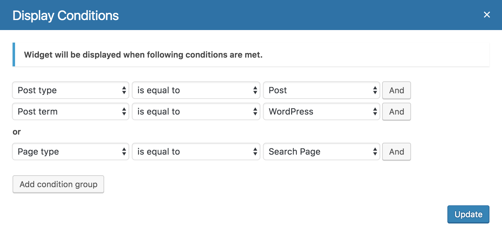

# Widget Display Conditions

License: GPLv2 or later
License URI: http://www.gnu.org/licenses/gpl-2.0.html
 
Manages widget display by conditions.

## Description

With an easy to use interface you can control on which page you want a particular widget to be displayed.

Following built-in condition parameters are available:

- post
- post type
- post term
- post type archive
- post template
- page
- page type
- page parent
- page template
 
## Installation

1. Upload `widget-display-conditions` plugin folder to the `/wp-content/plugins/` directory
1. Activate the plugin through the 'Plugins' menu in WordPress
 
## Screenshots

